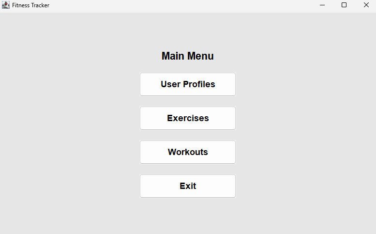
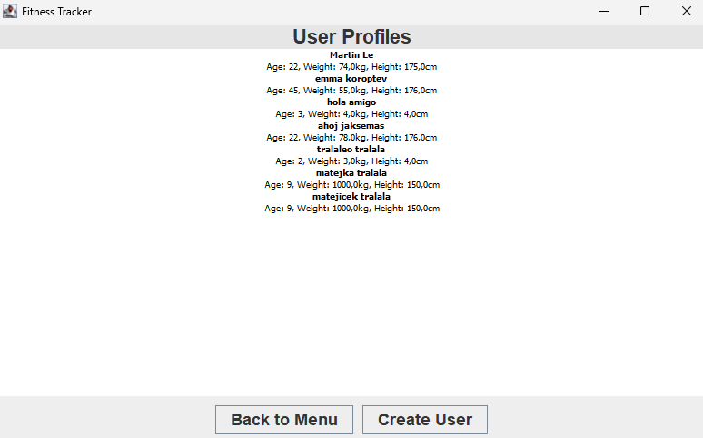
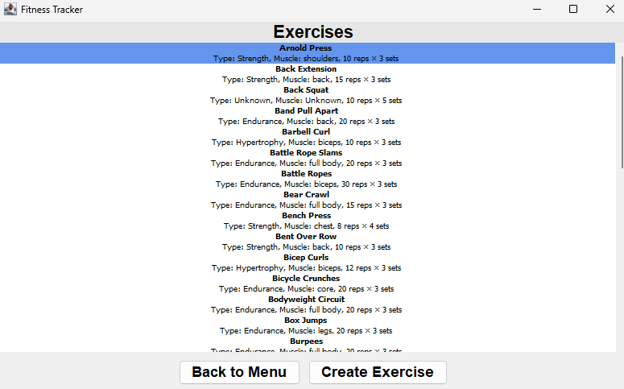
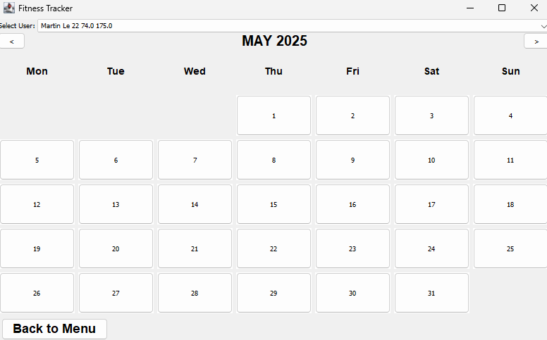

# fitness-tracker
Fitness tracker in java

### Prerequisites

- Java 21
- Maven 3.6+

## Overview
This is a simple fitness tracker app, that allows users to manage their workouts and track their activity. The app is built using Java and Swing for the GUI.

## Features
- Profile management
- Exercises management
  - Add, edit, delete exercises
  - Type, Muscle group, reps x sets properties
- Workouts management
  - Add, edit, delete workouts
  - Add exercises to workouts
  - Track workout history for each user

## Usage

1. Launch the application.
   
2. Create a new user profile.
   
3. Add exercises with details - type, muscle group, and reps/sets.
    
4. Create a workout by selecting a date and adding exercises.
   
5. Track your progress by viewing past workouts on the calendar.

## Data Persistence
- Users and Exercises are stored using csv files
- Workouts are stored in a json file
  - workout history paired with each user

## Technologies Used
- Java
- Swing
- Maven
- [org.json](https://github.com/stleary/JSON-java)